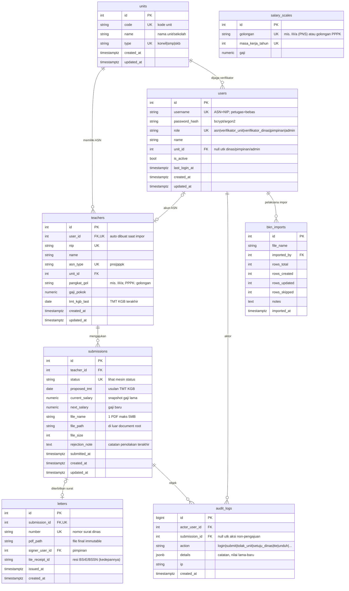
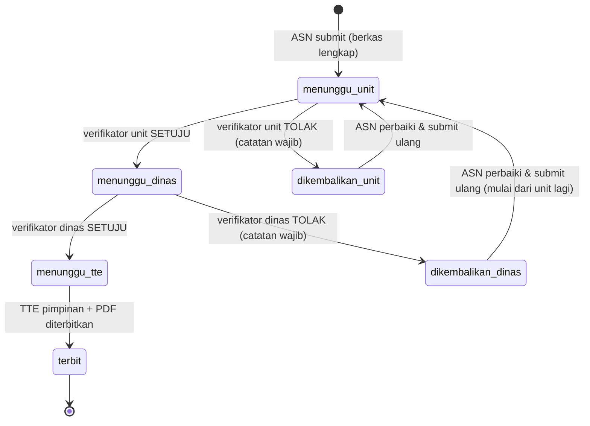

# DATABASE ERD — SI CENDIKIA v0.3 (DRAF)

> Fase 2 dari 6. Sumber: PRD v1.2 (final) + referensi sistem e-KGB. Menunggu review owner.

## 1. Prinsip Desain

1. **Sederhana & ringan** (NF-1, NF-2): 8 tabel total, monolitik, tanpa tabel yang "suatu hari mungkin berguna".
2. **Snapshot data penting**: pengajuan menyimpan salinan gaji saat diajukan, agar perubahan master data BKN di kemudian hari tidak mengubah surat yang sudah terbit.
3. **Satu berkas = kolom pada pengajuan**: keputusan owner menetapkan tepat 1 PDF per pengajuan, maka tidak perlu tabel lampiran terpisah (lebih sederhana, lebih sedikit join).
4. **Audit trail terpisah**: semua aksi dicatat di satu tabel log yang tidak pernah di-update/dihapus.
5. Surat final **immutable**: baris `letters` tidak pernah diubah setelah terbit.
6. **Perubahan data lewat pengajuan KGB** (PRD F-22..F-24): nilai perubahan dibawa pengajuan; master data `teachers` diperbarui otomatis saat surat diterbitkan. Tidak ada tabel perubahan terpisah.

## 2. Diagram ER (Mermaid)

## 3. Mesin Status Pengajuan

Nilai kolom `submissions.status`: `menunggu_unit`, `menunggu_dinas`, `menunggu_tte`, `dikembalikan_unit`, `dikembalikan_dinas`, `terbit`.

**Asumsi yang perlu konfirmasi** (lihat §6): pengajuan yang ditolak Dinas lalu di-submit ulang harus melewati verifikasi unit lagi dari awal (jenjang penuh).

## 4. Catatan Per Tabel

| Tabel | Catatan penting |
|---|---|
| `users` | Akun ASN diprovisi otomatis saat impor BKN: `username = NIP`, `password = hash(NIP)` (kebijakan owner, F-1). Rate-limiting login tidak pakai tabel (implementasi in-memory, seperti e-KGB) demi keringanan. |
| `teachers` | Master data ASN hasil impor file BKN (F-18). Satu guru = satu baris; impor berikutnya meng-update baris yang sudah ada berdasarkan NIP. |
| `submissions` | `current_salary`/`next_salary` di-snapshot saat submit. `file_*` wajib terisi sebelum status meninggalkan draf. ASN boleh punya beberapa pengajuan historis (KGB tiap 2 tahun), tapi hanya satu yang aktif berproses (enforced di aplikasi). Sekaligus sarana perubahan data (PRD F-22): saat status `terbit`, nilai yang disetujui diterapkan ke `teachers` (`gaji_pokok ← next_salary`, `tmt_kgb_last ← proposed_tmt`). |
| `letters` | Satu surat per pengajuan (`submission_id` UNIQUE). `number` mengikuti tata nomor surat dinas (lihat §6). Setelah `issued_at` terisi, baris tidak boleh diubah. |
| `audit_logs` | Append-only. Minimal action: `login`, `login_gagal`, `submit`, `setuju_unit`, `tolak_unit`, `setuju_dinas`, `tolak_dinas`, `tte`, `terbit`, `unduh_berkas`, `unduh_surat`, `impor_bkn`. |
| `bkn_imports` | Riwayat impor untuk keterlacakan admin. Impor hanya sekali di awal (seeding); perubahan data selanjutnya lewat pengajuan KGB (F-22). |
| `salary_scales` | Tabel referensi skala gaji pokok (golongan × masa kerja) untuk menghitung `next_salary` otomatis; di-seed dari peraturan gaji yang berlaku. Bisa dinonaktifkan jika master data sudah memuat gaji berikutnya. |

## 5. Indeks & Batasan Penting

- `users(username)` UNIQUE, `teachers(nip)` UNIQUE, `teachers(user_id)` UNIQUE
- `letters(number)` UNIQUE, `letters(submission_id)` UNIQUE
- `salary_scales(golongan, masa_kerja_tahun)` UNIQUE
- Indeks query panas: `submissions(status)`, `submissions(teacher_id)`, `teachers(unit_id)`, `audit_logs(submission_id, created_at)`
- FK `submissions.teacher_id`, `letters.submission_id`, `audit_logs.submission_id`

## 6. Item yang Perlu Diputuskan Sebelum Skema Final

1. **Submit ulang setelah tolak Dinas** — kembali ke antrean unit (jenjang penuh, asumsi saya) atau langsung ke Dinas?
2. **Tata nomor surat** — format pastinya (mis. `800/xxx/4.2/2026`)? Perlu contoh nomor surat KGB yang berlaku di Dinas.
3. **Masa berlaku / periode** — perlu kolom tahun periode pengajuan, atau cukup dari `proposed_tmt`?
4. **`salary_scales` dipakai atau tidak** — tergantung apakah file BKN Dinas sudah memuat gaji berikutnya. Kalau sudah, tabel ini dihapus (lebih ringan).
5. **Basis data** — keputusan final ada di fase TECH STACK; ERD ini ditulis netral (tipe PostgreSQL sebagai acuan karena e-KGB memakai PostgreSQL 16).
