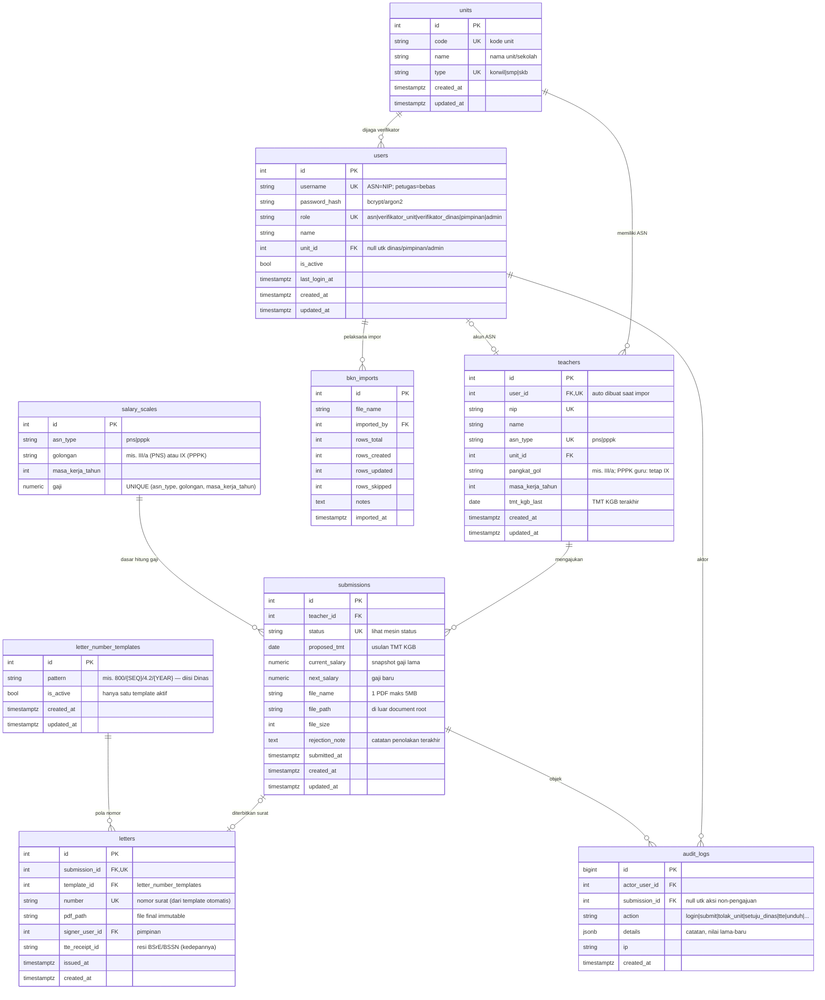
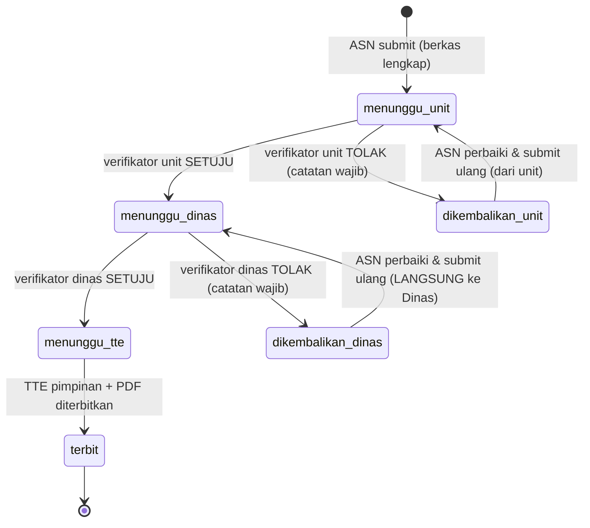

# DATABASE ERD — SI CENDIKIA v1.0 (FINAL)

> Fase 2 dari 6 — **FINAL, disetujui owner 2026-08-16**. Sumber: PRD v1.3 + referensi sistem e-KGB.

## 1. Prinsip Desain

1. **Sederhana & ringan** (NF-1, NF-2): 9 tabel total, monolitik, tanpa tabel yang "suatu hari mungkin berguna".
2. **Snapshot data penting**: pengajuan menyimpan salinan gaji saat diajukan, agar perubahan master data BKN di kemudian hari tidak mengubah surat yang sudah terbit.
3. **Satu berkas = kolom pada pengajuan**: keputusan owner menetapkan tepat 1 PDF per pengajuan, maka tidak perlu tabel lampiran terpisah (lebih sederhana, lebih sedikit join).
4. **Audit trail terpisah**: semua aksi dicatat di satu tabel log yang tidak pernah di-update/dihapus.
5. Surat final **immutable**: baris `letters` tidak pernah diubah setelah terbit.
6. **Perubahan data lewat pengajuan KGB** (PRD F-22..F-24): nilai perubahan dibawa pengajuan; master data `teachers` diperbarui otomatis saat surat diterbitkan. Tidak ada tabel perubahan terpisah.
7. **Gaji tidak disimpan di master** (PRD F-5, keputusan owner #8): gaji dihitung dari tabel `salary_scales` (PNS & PPPK terbaru) berdasarkan masa kerja dan pangkat/golongan; pengajuan men-snapshot hasilnya saat submit. PPPK guru golongan tetap IX.

### 7a. Logika Pencarian Gaji (PENTING — jangan tertukar)

```
Gaji PNS  = salary_scales WHERE asn_type='pns'
                            AND golongan = <pangkat_gol guru>   -- mis. III/a, IV/b
                            AND masa_kerja_tahun = <masa kerja>
            → pangkat/golongan DAN masa kerja sama-sama menentukan gaji.

Gaji PPPK = salary_scales WHERE asn_type='pppk'
                            AND golongan = 'IX'                 -- guru: tetap IX
                            AND masa_kerja_tahun = <masa kerja>
```

- KGB menaikkan gaji satu tingkat masa kerja (+2 tahun): `current_salary` = lookup masa kerja saat ini; `next_salary` = lookup masa kerja + 2 (golongan sama).
- Jika kombinasi tidak ditemukan di tabel (mis. masa kerja di luar rentang tabel), pengajuan ditolak sistem dengan pesan jelas, bukan ditebak.
- PNS dan PPPK memakai tabel yang sama tetapi **dimensi `asn_type` memisahkan keduanya** — tidak mungkin tertukar.

## 2. Diagram ER (Mermaid)



## 3. Mesin Status Pengajuan



Nilai kolom `submissions.status`: `menunggu_unit`, `menunggu_dinas`, `menunggu_tte`, `dikembalikan_unit`, `dikembalikan_dinas`, `terbit`.

**Aturan submit ulang (keputusan owner)**: ditolak unit (Korwil/SMP/SKB) → submit ulang mulai dari `menunggu_unit`; ditolak Dinas → submit ulang langsung `menunggu_dinas` (tidak kembali ke unit). Implementasi: satu kolom `status` cukup; riwayat lengkap tersimpan di `audit_logs`.

## 4. Catatan Per Tabel

| Tabel | Catatan penting |
|---|---|
| `users` | Akun ASN diprovisi otomatis saat impor BKN: `username = NIP`, `password = hash(NIP)` (kebijakan owner, F-1). Akun petugas (verifikator/pimpinan/admin) diimpor dari daftar resmi `local/akun-admin/daftar-akun-petugas.xlsx` dengan **username pola khusus, TIDAK boleh sama dengan NIP** (F-2, keputusan #9); password awal di-hash saat impor, wajib diganti? (kebijakan di fase TECH STACK). Rate-limiting login tidak pakai tabel (implementasi in-memory, seperti e-KGB) demi keringanan. |
| `teachers` | Master data ASN hasil impor file BKN (F-18). Satu guru = satu baris. Kolom: identitas + pangkat/golongan + **masa kerja** + TMT KGB terakhir. **Tidak ada kolom gaji** — gaji dihitung dari `salary_scales`. PPPK guru: `pangkat_gol` divalidasi tetap `IX`. |
| `submissions` | `current_salary`/`next_salary` di-snapshot saat submit, **dihitung dari `salary_scales`** (masa kerja saat ini dan masa kerja +2, pangkat/golongan guru). `file_*` wajib terisi sebelum status meninggalkan draf. ASN boleh punya beberapa pengajuan historis (KGB tiap 2 tahun), tapi hanya satu yang aktif berproses (enforced di aplikasi). Sekaligus sarana perubahan data (PRD F-22): saat status `terbit`, nilai yang disetujui diterapkan ke `teachers` (`tmt_kgb_last ← proposed_tmt`). |
| `letters` | Satu surat per pengajuan (`submission_id` UNIQUE). `number` dihasilkan dari `letter_number_templates` aktif saat terbit (token `{SEQ}` nomor urut per tahun, `{YEAR}` tahun; token lain bebas diisi Dinas). Setelah `issued_at` terisi, baris tidak boleh diubah. |
| `audit_logs` | Append-only. Minimal action: `login`, `login_gagal`, `submit`, `setuju_unit`, `tolak_unit`, `setuju_dinas`, `tolak_dinas`, `tte`, `terbit`, `unduh_berkas`, `unduh_surat`, `impor_bkn`. |
| `bkn_imports` | Riwayat impor untuk keterlacakan admin. Impor hanya sekali di awal (seeding); perubahan data selanjutnya lewat pengajuan KGB (F-22). |
| `salary_scales` | **Wajib** (keputusan owner #8): skala gaji pokok resmi terbaru untuk PNS (PP 5/2024) dan PPPK (Perpres 11/2024) per golongan × masa kerja. Di-seed sekali; pembaruan jika ada regulasi baru. Gaji PPPK guru hanya golongan IX. |
| `letter_number_templates` | Template nomor surat yang dapat diisi/diatur Dinas (F-16). Hanya satu template `is_active = true` pada satu waktu; perubahan template tidak mengubah surat yang sudah terbit. |

## 5. Indeks & Batasan Penting

- `users(username)` UNIQUE, `teachers(nip)` UNIQUE, `teachers(user_id)` UNIQUE
- `letters(number)` UNIQUE, `letters(submission_id)` UNIQUE
- `salary_scales(asn_type, golongan, masa_kerja_tahun)` UNIQUE
- `letter_number_templates(is_active)` — parsial, maksimal satu baris aktif
- Indeks query panas: `submissions(status)`, `submissions(teacher_id)`, `teachers(unit_id)`, `audit_logs(submission_id, created_at)`, `salary_scales(asn_type, golongan, masa_kerja_tahun)`
- FK `submissions.teacher_id`, `letters.submission_id`, `letters.template_id`, `audit_logs.submission_id`

## 6. Catatan Penutup

Semua item terbuka telah diputuskan owner (lihat decision log):
- Kolom tahun periode: **tidak perlu** — periode diturunkan dari `proposed_tmt` (disetujui owner).
- Aturan submit ulang, template nomor surat, sumber gaji: final.
- Basis data: keputusan teknis final di fase TECH STACK; ERD ini ditulis netral (tipe PostgreSQL sebagai acuan karena e-KGB memakai PostgreSQL 16).
