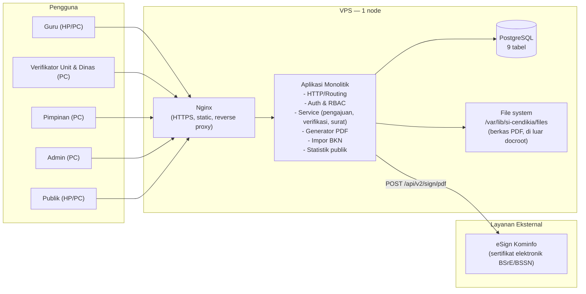
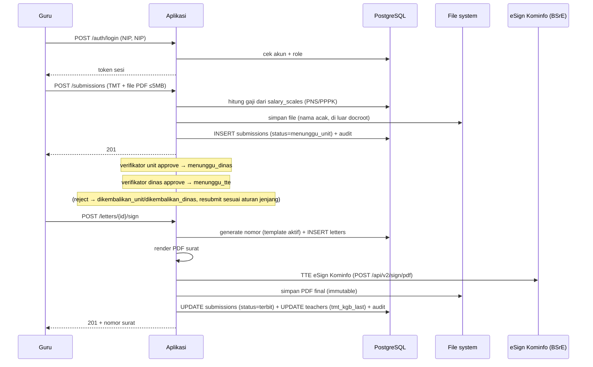

# ARCHITECTURE — SI CENDIKIA v1.2 (FINAL)

> Fase 5 dari 6 — **FINAL (v1.2: harmonisasi editorial referensi TTE ke eSign Kominfo, tanpa perubahan desain; v1.1: TTE via eSign Kominfo), disetujui owner 2026-08-16**. Sumber: PRD v1.6, ERD v1.0 FINAL, API v1.2, UI/UX v1.0.

## 1. Tujuan dan Prinsip Arsitektur

Arsitektur SI CENDIKIA dirancang untuk satu tujuan: **sederhana, ringan, dan mudah dirawat** (PRD NF-1, NF-2). Konsekuensinya:

1. **Monolitik** — satu aplikasi, satu proses, satu basis data. Tidak ada microservice, message queue, atau cache terpisah.
2. **Satu server** — seluruh aplikasi hidup di satu VPS kecil (1–2 core, 2GB RAM).
3. **Pemisahan penyimpanan** — basis data PostgreSQL + file sistem untuk berkas PDF (di luar document root).
4. **API internal** — frontend dan backend satu kesatuan; endpoint API (API v1.1) adalah kontrak antara keduanya dan tetap terbuka untuk integrasi lain.
5. **Audit append-only** — semua perubahan status terekam, tidak ada yang bisa mengubah atau menghapus jejak.

## 2. Diagram Arsitektur

Catatan: TTE memakai layanan eSign Kominfo dengan sertifikat elektronik BSrE/BSSN. Ini integrasi nyata sejak v1.1, bukan mode simulasi (detail alur di §6).

## 3. Komponen Aplikasi

| Komponen | Tanggung jawab | Sesuai |
|---|---|---|
| **HTTP & routing** | Terima request, jalankan middleware (auth, RBAC, rate limit), arahkan ke handler | API v1.1 |
| **Auth & RBAC** | Login/logout, sesi/token, pemisahan hak 5 peran, rate limit 5×/15 menit | PRD F-1..F-4 |
| **Service pengajuan** | Buat/submit/resubmit, hitung gaji dari `salary_scales` (ERD §7a), validasi PDF ≤5MB, snapshot | PRD F-5..F-9a |
| **Service verifikasi** | Antrean unit/dinas, approve/reject, mesin status | PRD F-10..F-13, ERD §3 |
| **Service surat** | Konsep dari template e-KGB, nomor otomatis dari template aktif, render PDF, TTE, terbit + update master | PRD F-14..F-17 |
| **Service admin** | Impor BKN + provisi akun, master unit/pengguna, skala gaji, template nomor, audit | PRD F-18..F-21 |
| **Service publik** | Statistik agregat `GET /public/stats` | PRD F-28 |
| **Generator PDF** | Render template surat (variabel: nomor, nama, NIP, unit, TMT, gaji lama→baru, tanggal) | API v1.1, referensi e-KGB |
| **Impor BKN** | Parse file BKN, cocokkan per NIP (tambah/update), buat akun ASN (username=NIP, password=hash NIP), catat riwayat | PRD F-18 |

## 4. Alur Data (End-to-End)

## 5. Keputusan Desain Kunci

| # | Keputusan | Alasan | Konsekuensi |
|---|---|---|---|
| A-1 | Satu proses monolitik | NF-1/NF-2; mudah deploy & debug di VPS 2GB | Tidak ada scaling horizontal terpisah |
| A-2 | Berkas PDF disimpan di luar document root (`/var/lib/si-cendikia/files`), nama file acak (UUID), path disimpan di DB | PRD NF-4; file tidak pernah bisa diakses langsung via URL | Akses hanya lewat endpoint terotorisasi (`GET /submissions/{id}/file`, `GET /letters/{id}/download`) |
| A-3 | Satu tabel `audit_logs` append-only untuk semua aksi | Sederhana, satu tempat telusur | Aplikasi tidak punya operasi UPDATE/DELETE untuk tabel ini |
| A-4 | Gaji dihitung saat submit dan di-snapshot | ERD §2 prinsip #2 | Perubahan skala gaji tidak mengubah surat yang sudah terbit |
| A-5 | Status cukup satu kolom + riwayat di audit | Keputusan owner (submit ulang unit vs dinas) | Mesin status sederhana, tidak ada kolom versi berulang |
| A-6 | `GET /public/stats` di-cache 5 menit | Data agregat jarang berubah | Beban rendah; tanpa cache perlu hitung ulang tiap request |
| A-7 | TTE eSign Kominfo terisolasi di belakang satu fungsi/interface | Mudah ganti environment dev/prod & debugging | Aplikasi lain tidak tahu detail mekanisme TTE |

## 6. Integrasi TTE eSign Kominfo (BSrE/BSSN)

TTE memakai **layanan resmi eSign Kominfo** — API "Esign Client Service for User 2.2.2" (arsip Kominfo di `local/esign-kominfo/`, tidak di-commit). Ini integrasi nyata, bukan mode simulasi:

- **Env dev**: `https://esign-dev.layanan.go.id` (kredensial uji ada di environment Postman, lokal saja).
- **Alur** (detail pola di PRD §10):
  1. Render konsep surat → PDF. Naskah diisi dari **template DOCX dinas** (`internal/pdf/templates/pns.docx` dan `pppk.docx`) dengan penggantian placeholder, dikonversi ke PDF oleh **LibreOffice** (`soffice`) di server.
  2. Pimpinan menginput passphrase di layar TTE (tidak disimpan).
  3. `POST /api/v2/sign/pdf` — body JSON: `nik` pimpinan, `passphrase`, `signatureProperties[0]` = {imageBase64 TTD pimpinan, tampilan VISIBLE, page 1, originX/originY/width/height sesuai blok ttd template}, `file` = base64 PDF.
  4. Simpan `id_dokumen` → `letters.tte_receipt_id`.
  5. `GET /api/sign/download/{id_dokumen}` → PDF final tersimpan (immutable).
- **Dasar auth aplikasi ke eSign**: Basic Auth (username/password eSign milik Dinas) untuk endpoint yang memerlukan; dikonfigurasi di `.env` aplikasi, tidak pernah di-commit.
- **Kegagalan**: pengajuan tetap `menunggu_tte`, pesan error jelas, tidak ada data setengah terbit (transaksi atomik).
- **Verifikasi** (opsional, ke depan): `POST /api/sign/verify` untuk audit keaslian PDF tersign.

## 7. Keamanan

| Aspek | Desain |
|---|---|
| Autentikasi | Login NIP/password; password di-hash (bcrypt/argon2); sesi/token dibatasi waktu |
| Rate limit login | 5 gagal / 15 menit per username/IP → `429` |
| RBAC | 5 peran terpisah; setiap endpoint divalidasi matriks akses (API v1.1 §2) |
| Upload | Validasi ekstensi + magic bytes PDF + ukuran ≤5MB; simpan di luar docroot; nama acak |
| Download | Hanya lewat endpoint ber-otorisasi; audit `unduh_berkas` / `unduh_surat` |
| Secret | Hanya di `.env` (tidak pernah di-commit); hook PreToolUse memblokir akses agent ke file kredensial |
| CSRF | Token CSRF untuk semua mutasi (jika sesi cookie) / per-token signature (jika header token) |
| Header HTTP | HTTPS wajib (Nginx), HSTS, X-Content-Type-Options, frame/clickjacking protection |
| PII | Beranda publik hanya agregat; endpoint `/public/stats` tanpa data pribadi |

## 8. Operasional

| Aspek | Desain |
|---|---|
| Deploy | Build artefak → salin ke server → systemd unit (satu service) → Nginx reverse proxy + SSL |
| Basis data | PostgreSQL 16; backup terjadwal (pg_dump harian + retensi) |
| Log | Aplikasi → log terstruktur (journald); audit → DB |
| Pemulihan | Restore dari backup DB + sinkronisasi file PDF (keduanya dibackup) |
| Pembaruan skala gaji | Impor baru saat regulasi terbit; surat lama tidak berubah (snapshot) |

## 9. Batasan yang Disengaja

- Tidak ada cache terdistribusi, queue, atau worker terpisah (satu proses cukup untuk skala kabupaten piloting).
- Tidak ada integrasi live ke Dapodik/BKN (master via impor file + pengajuan, sesuai keputusan owner).
- Tidak ada notifikasi push/email (guru memantau lewat aplikasi).
- Tidak ada fitur komentar antar verifikator (catatan penolakan cukup).

## 10. Risiko & Mitigasi

| Risiko | Mitigasi |
|---|---|
| Gaji tidak ditemukan di skala (masa kerja di luar rentang) | Tolak submit dengan pesan jelas + hubungi Dinas (ERD §7a) |
| File BKN rusak / format berubah | Validasi impor, laporan baris gagal, rollback parsial dengan catatan |
| Env eSign Kominfo (dev) berubah / tidak stabil | Kredensial & koleksi Postman di `local/`; cek `GET /api/user/status/{nik}` sebelum sign; kegagalan → pengajuan tetap `menunggu_tte`, tanpa data setengah terbit (§6) |
| Lonjakan masa pengajuan massal | Satu VPS 2GB cukup untuk ribuan guru (beban rendah, cache stats); monitor di fase uji |
| Password = NIP (keputusan owner) | Rate limit + audit `login_gagal` + hashing kuat sebagai mitigasi (PRD F-4, NF-5) |
